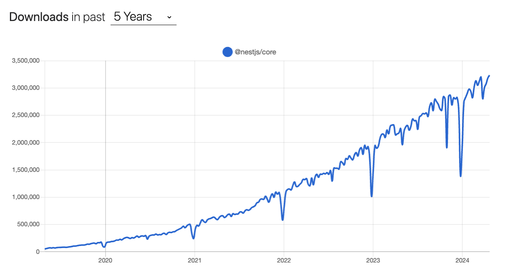

## NestJS Best Practices Recipe

My name is Ariel Weinberger, and I am the author of the [NestJS Zero to Hero](https://www.udemy.com/course/nestjs-zero-to-hero) course. This course has been the go-to resource for learning NestJS since 2020 and has helped **over 120,000 developers** learn NestJS.

  

Fast forward to 2024, NestJS has grown to become the #1 fastest growing Node.js framework in the world, with **3 million weekly downloads**!

I have spent the past few years building production-ready applications with NestJS, and I have learned a lot about what works and what doesn't. This codebase serves as a recipe for building production-ready NestJS applications following best practices.

### What's covered in this recipe?
Everything you need to build a solid NestJS application that serves millions of users in production:

- NestJS
- REST API
- Authentication/Authorization
- Validation
- Postgres
- Prisma
- Logging
